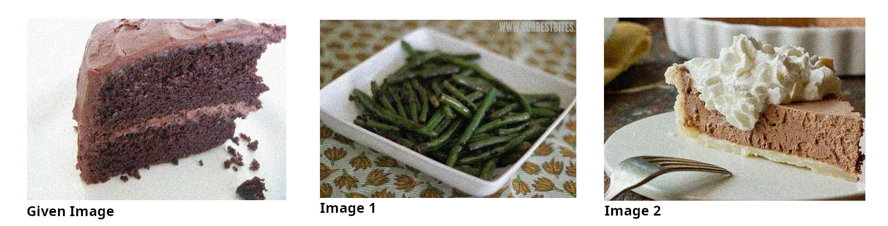

# Disclaimer:
This was an old exercise. Therefore it might be possible that current approaches largely differ from this approach. Also keep in mind that this task was solved under potential restrictions (solution approaches, model usage, hardware, time).
# Food Similarity Predction
The task is to create a model that is able to find the food that tastes similar (sweet/savoury) to the given food. More specifically you are given three pictures and need to decide wheter the second or the third images tastes more like the first image.

## Our Approach:
We use the pretrained RestNet-152 to create image features on all our images. We use another custom network to decide which image tastes similar using the computet image features. The custom network is trained on 59515 triplets (with the BCEWithLogitsLoss lossfunction, the ADAM optimizer and no data augmentation)